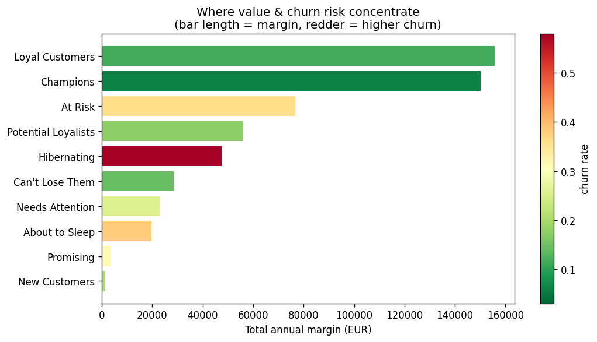

# AI-initiative-ROI-prioritization-simulator
# Customer Retention: From Churn Prediction to a Targeting Decision

Predicting churn for **Kaffeeliebe**, a DACH-region specialty-coffee subscription
retailer, and — the part that matters — turning model scores into a **euro-quantified
retention decision**: which customers to defend, and what it's worth.

> Most churn projects stop at "0.87 AUC". This one ends at "target these customers,
> save ~€X against a €Y campaign cost." The model is a means; the decision is the deliverable.

## Business question

Given a limited retention budget, **which customers should we spend it on** to save
the most gross margin? Answering that needs three things: who the customers are
(segmentation), who is likely to leave (a calibrated churn model), and what each
saved customer is worth (value-at-risk).

## Approach

| Phase | What | Status |
|---|---|---|
| 1 | EDA + RFM segmentation — where value & churn concentrate | ✅ Done |
| 2 | Feature engineering + churn model, **probability calibration**, lift/gains | 🔜 In progress |
| 3 | Expected-value targeting + retention-campaign ROI simulation | 🔜 Planned |
| 4 | Recommendation memo + polished notebook | 🔜 Planned |

## Key finding so far

Value and churn risk are unevenly distributed. High-churn **Hibernating** customers
are mostly low-value (defend selectively), while **At Risk** (~€77k annual margin,
35% churn) and **Can't Lose Them** (high-value, rising churn) are where a retention
budget earns its return. Churn falls cleanly across plan tiers (Basic 34% → Premium
15%); acquisition channel shows no signal — a null result worth reporting honestly.



## Repository

```
customer-retention/
├── data/              customers.csv, customer_segments.csv (synthetic)
├── src/               generate_data.py, 01_segmentation.py
├── reports/figures/   segmentation charts
└── docs/              data_dictionary.md
```

## Reproduce

```bash
pip install -r requirements.txt
python src/generate_data.py       # build the synthetic customer base
python src/01_segmentation.py     # EDA + RFM segmentation + figures
```

## Notes & limitations

- Data is **synthetic** but built with realistic, noisy signal (churn is a logistic
  function of the drivers with an interaction term and gaussian noise), so the model
  earns a believable ~0.87 ROC-AUC rather than an artificial 0.99.
- Churn is defined on a trailing 12-month window; no historization (latest snapshot).
- Next extension: uplift modelling (targeting *persuadable* churners, not just likely
  ones) and a slowly-changing view if historical snapshots became available.
